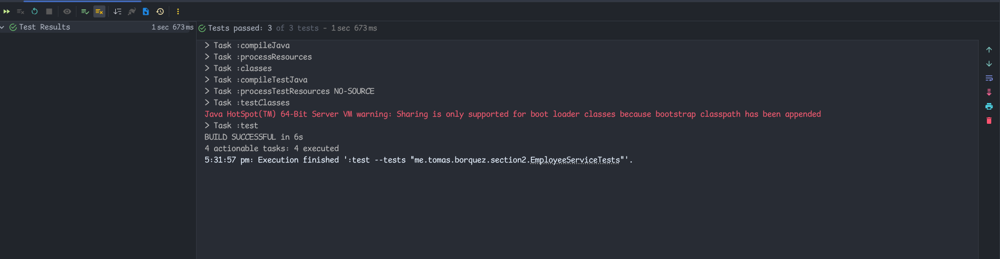

I added the required endpoints and even added a file called 
`endpoints.http`, so it is easier to test the endpoints added if you are using **IntelliJ**, and 
click on the different endpoints to test them.

This shows the tests passing:

To the tests you don't need to run the server on the background, just configure the
project with Java 17 and you should be good to go and run them directly through the IDE.
