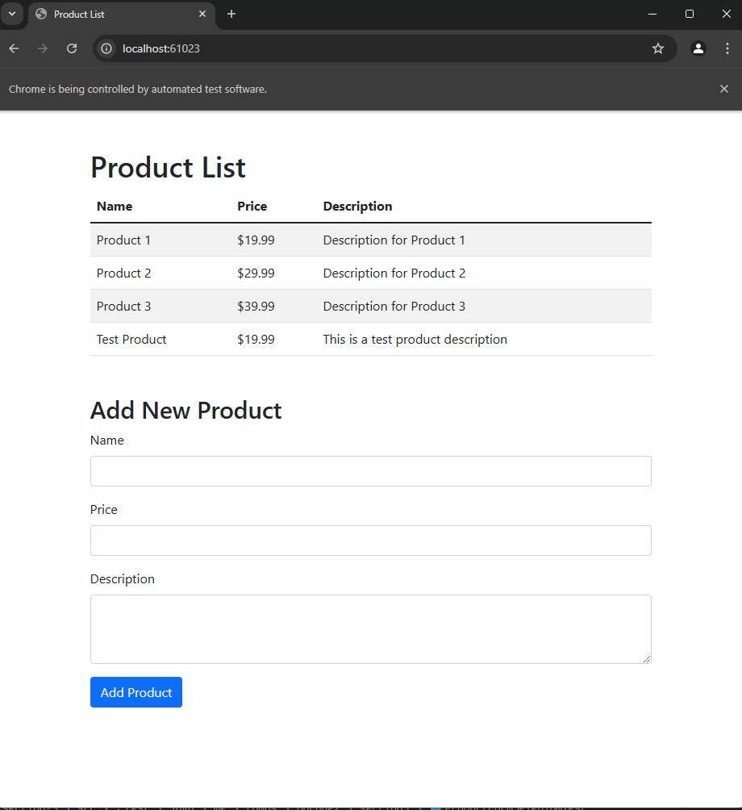
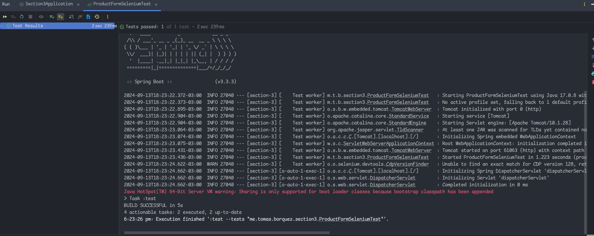

This follows the MVC architecture and the folder structure recommended on
JSP documentation where they recommend you to add your templates on
`src/main/webapp/WEB-INF/views/*.jsp`.

These are the tests running and passing:

To the tests you don't need to run the server on the background, just configure the 
project with Java 17 and you should be good to go and run them directly through the IDE.